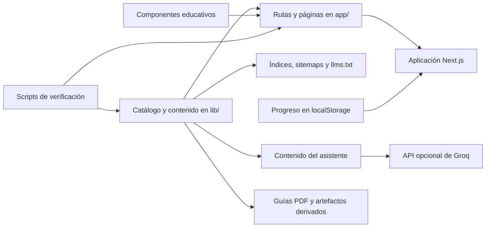

# Arquitectura y contenido

Este documento describe cómo se organiza Aulafy y dónde debe realizarse cada tipo de cambio.

## Resumen

Aulafy es una aplicación Next.js que genera páginas educativas desde un catálogo central, páginas de lección, contenido estructurado e índices derivados. La navegación y el progreso funcionan en el navegador. El único servicio de IA en tiempo de ejecución es el chat opcional, que usa Groq y puede limitar peticiones con Upstash Redis.

## Capas principales

### Aplicación web

- `app/`: rutas, páginas, metadatos, endpoints y API del chat.
- `components/`: navegación, fichas, lecciones, progreso, búsqueda y elementos visuales.
- `app/globals.css` y estilos asociados: sistema visual y diseño adaptable.

La aplicación usa Next.js 16 con App Router, React 19, TypeScript y Tailwind CSS 4. Three.js se utiliza en la portada interactiva.

### Contenido y catálogo

- `lib/cursos.ts`: fuente principal del catálogo español y del orden de las lecciones.
- `lib/course-groups.ts`: agrupación visible del catálogo español; todos los cursos deben aparecer exactamente una vez.
- `app/cursos/`: páginas de las lecciones que tienen implementación propia.
- `lib/foundation-course-content.ts`: bloques del curso de fundamentos.
- `lib/codex-course-content.ts`: contenido estructurado del curso de Codex.
- `lib/english-lesson-content.json`: versiones inglesas estructuradas.
- `lib/course-guidance.ts`: público, requisitos, tiempo, objetivos y entregables.
- `lib/learning-paths.ts`: rutas de aprendizaje por objetivo.
- `lib/ai-program.ts`: programa progresivo y perfiles.
- `lib/blog.ts` y `lib/seo-landings.ts`: artículos y páginas temáticas.

No debe duplicarse manualmente una lista de cursos si puede derivarse de `lib/cursos.ts`.

### Descubrimiento y SEO

- `lib/seo-index.ts`: índice común de rutas y descripciones.
- `app/sitemap.ts` y `app/sitemaps/`: mapas del sitio.
- `app/llms.txt/`, `app/llms-full.txt/` y `app/ai.txt/`: índices para asistentes.
- `app/search-index.json/`: índice legible por máquinas.
- `app/robots.ts`, `app/manifest.ts` y datos JSON-LD: descubrimiento y metadatos.

Cuando cambie la definición de Aulafy, deben revisarse el README, `docs/QUE-ES-AULAFY.md`, `app/que-es-aulafy/page.tsx`, `app/layout.tsx`, `app/ai.txt/route.ts`, `app/llms.txt/route.ts` y `lib/seo-index.ts`.

### Progreso

El avance se guarda en `localStorage` mediante `lib/progress.ts`. No existe una cuenta de usuario ni una base de datos central de alumnos. El progreso puede exportarse e importarse como JSON.

### Chat opcional

`app/api/chat/route.ts` recupera fragmentos del contenido local y envía el contexto a Groq. El navegador no recibe la clave del proveedor. Si Upstash está configurado, `lib/ratelimit.ts` limita las peticiones por identificador derivado de la IP.

La aplicación educativa debe seguir funcionando cuando el chat no está configurado.

### PDFs y archivos derivados

- `pdf/`: fuentes y generación de las guías de Claude Code.
- `scripts/collect-ebook-content.cjs` y `scripts/render-ebook.py`: recopilación y renderizado del manual general.
- `public/*.pdf` y `output/pdf/`: artefactos generados.

Si se modifica contenido que aparece en un PDF, debe indicarse si el PDF necesita regenerarse. Los archivos derivados no deben editarse como única fuente del cambio.

## Flujo recomendado para contenido

1. Identificar la fuente de verdad correspondiente.
2. Corregir primero el contenido canónico en español.
3. Actualizar la versión inglesa si el cambio afecta significado, seguridad o navegación.
4. Revisar catálogo, guía del curso, índices y enlaces relacionados.
5. Regenerar contenido del asistente o PDFs cuando corresponda.
6. Ejecutar las verificaciones específicas y revisar el resultado visual.

## Verificaciones

| Alcance del cambio | Comandos mínimos |
| --- | --- |
| Documentación Markdown | Revisar enlaces y ejecutar `npm run verify-links` |
| Texto o lección | `npm run verify-content` y la verificación específica del curso |
| Catálogo o rutas | `npm run audit-education`, `npm run verify-program`, `npm run verify-i18n`, `npm run verify-links` |
| Metadatos o SEO | `npm run verify-seo` y `npm run build` |
| Progreso | `npm run verify-progress` |
| Código o componentes | `npm run lint` y `npm run build` |
| Cambio educativo amplio | `npm run audit-education` |

## Variables y secretos

Las variables documentadas están en `.env.example`. Los valores reales deben vivir en `.env.local` o en el gestor de secretos del despliegue.

Nunca deben añadirse al repositorio:

- claves de Groq, Anthropic, OpenAI, Upstash o cualquier otro proveedor;
- archivos `.env` con valores reales;
- tokens incluidos en capturas, PDFs, registros o ejemplos;
- datos personales de estudiantes, clientes o colaboradores;
- volcados de bases de datos o conversaciones privadas.

Los tokens de verificación que deben ser públicos por protocolo se documentan como tales y no se reutilizan como credenciales privadas.

## Despliegue

El destino principal es Vercel. `vercel.json` ejecuta `npm run build` y publica la salida de Next.js. Antes de desplegar deben estar configuradas la URL canónica y, si se usa el chat, sus credenciales de servidor.

Contacto técnico y editorial: [learntouseai@gmail.com](mailto:learntouseai@gmail.com).
