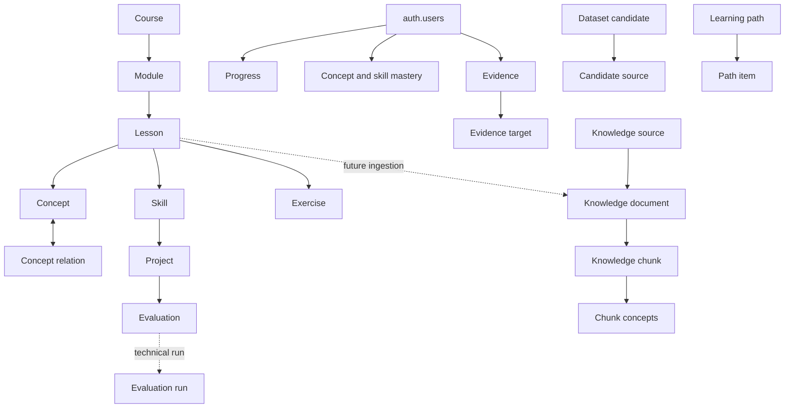

# Aulafy M0.1 Data Model

Migration: `supabase/migrations/20260905120000_aulafy_m01_domain_foundation.sql`. New tables use the `aulafy_` prefix so this foundation does not collide with the existing social-learning schema.

## Boundaries

- `Lesson` is editorial content with a stable `content_id` and hash. Its body remains in Git.
- `KnowledgeDocument` is an ingestible representation and can originate from official documentation or research without becoming a lesson.
- `Progress` records activity. `Mastery` is a later evidence-based assessment; completion alone does not set mastery to 1.
- `Evaluation` is a pedagogical or quality definition. `EvaluationRun` is one technical execution.
- `DatasetCandidate` is not canonical or training-ready until reviewed.

## Delete and security policy

Editorial and knowledge records use `RESTRICT` so historical evidence is not silently destroyed. User state follows `auth.users` with `CASCADE` for account deletion. Public catalog reads are limited by status; progress, mastery and evidence use owner-only policies based on `auth.uid()`. RLS is not a substitute for future server-side authorization.

## Deferred

M0.1 adds no embeddings, vector search, tutor, provider calls, ingestion worker, mastery algorithm or model training. The embedding-related metadata columns only reserve a future compatibility boundary; no vector extension or values are introduced.
